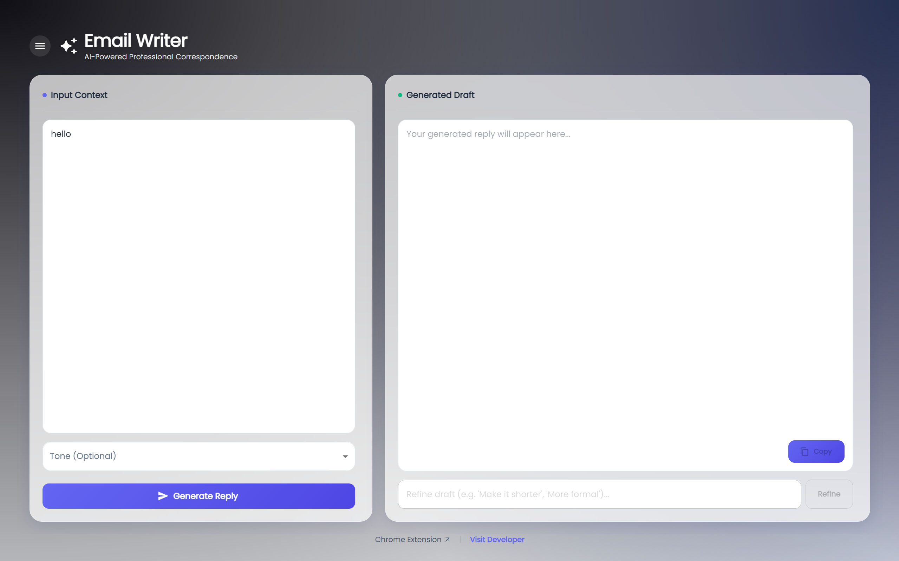

# Email-Writer Assistant

A modern, AI-powered email writing assistant built with **React (Vite)**, **Material UI**, and **Spring Boot**, leveraging the **Gemini API** for intelligent content generation.

## 🚀 Key Features

### 📧 AI-Powered Email Generation

- **Context-Aware Drafting**: Provide a brief context or paste an email you received, and get a professional reply instantly.
- **Tone Customization**: select from multiple tones including _Professional_, _Casual_, _Friendly_, _Urgent_, and _Apologetic_.
- **Smart Refinement**: Iteratively refine drafts with natural language instructions like _"Make it shorter"_ or _"Sound more authoritative"_.

### 📱 Modern & Responsive UI

- **Glassmorphism Design**: Sleek, modern interface with blurred backgrounds and smooth gradients.
- **Mobile-First Experience**: Optimized layout for all devices.
  - Sidebar transforms into a slide-over menu on mobile.
  - Input fields maximize space for comfortable typing.
  - Floating Copy button for quick actions.
  - Auto-scroll to generated responses.

### 💾 History Management

- **Local History**: Automatically saves your generated emails locally.
- **Quick Access**: Sidebar (or drawer on mobile) lists past drafts for easy retrieval.
- **Management Tools**:
  - One-click to reload past drafts.
  - Delete individual history items.
  - Clear entire history.
  - "No emails yet" empty state guidance.

### 🛠️ Technical Highlights

- **Frontend Containerization**: Production-ready Nginx setup with security patches.
- **Backend Containerization**: Optimized Spring Boot Docker image.
- **Deployment**: Full-stack `docker-compose` orchestration.

## 💻 Technlogy Stack

- **Frontend**: React, Vite, Material UI (MUI)
- **Backend**: Java Spring Boot
- **AI**: Google Gemini API
- **DevOps**: Docker
